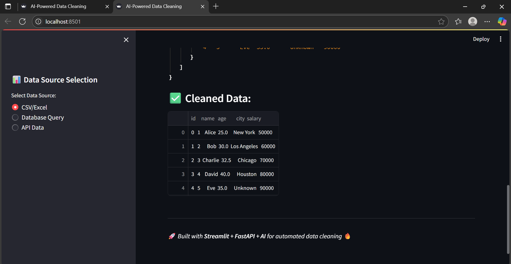
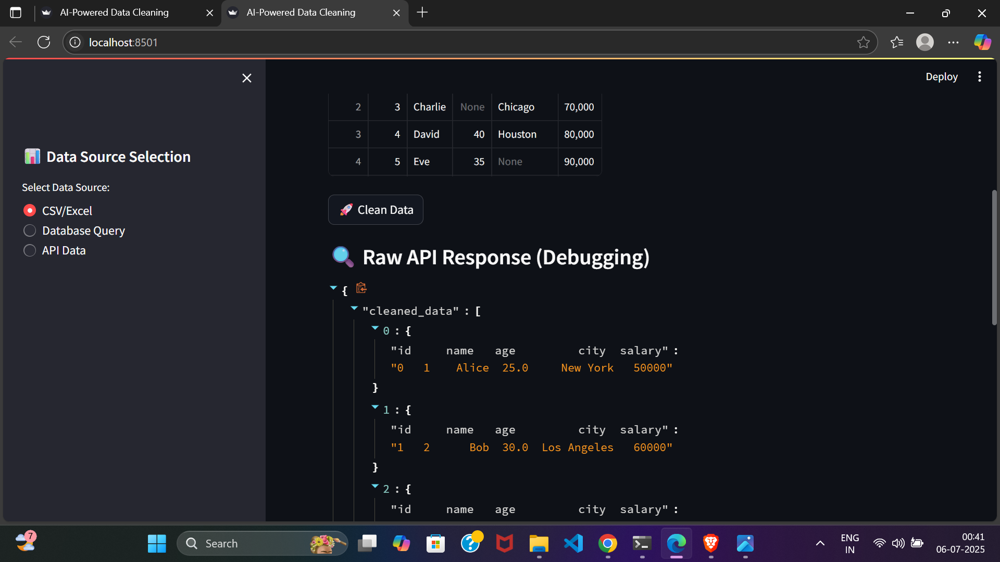

# 🧹 AI-Powered Data Cleaning System

##  Overview
The **AI-Powered Data Cleaning System** is a **Streamlit + FastAPI + AI** application that automates data cleaning using **rule-based** and **AI-powered techniques**. It supports data ingestion from **CSV/Excel files, Database queries, and API endpoints** and processes them using **LangChain AI agents** to enhance data quality.

##  Features

- ✅ **Multi-source Data Ingestion**: Supports CSV/Excel, SQL queries, and API endpoints.
- ✅ **AI-driven Data Cleaning**: Uses LangChain AI Agents for intelligent cleaning.
- ✅ **Rule-based Data Preprocessing**: Handles missing values, duplicates, and formatting.
- ✅ **Web UI with Streamlit**: A user-friendly interface for data selection and preview.
- ✅ **FastAPI Backend**: Handles requests and integrates AI-based transformations.
- ✅ **Real-time Processing**: Instant feedback and preview of cleaned data.

---

##  Architecture & Flow
### **1️⃣ Data Ingestion**
- Users can upload **CSV/Excel** files.
- Users can enter **SQL Queries** to fetch database data.
- Users can enter an **API Endpoint** to retrieve JSON data.

### **2️⃣ Data Cleaning**
- **Rule-Based Cleaning**:
  - Handles missing values (imputation)
  - Removes duplicates
  - Standardizes column formats
- **AI-Powered Cleaning**:
  - Uses **LangChain AI Agent** to enhance data quality
  - Automates complex transformations

### **3️⃣ Processing & Execution**
1. **Frontend (Streamlit)**
   - Accepts user input (File Upload, SQL Query, or API URL)
   - Sends requests to FastAPI
   - Displays **Raw Data & Cleaned Data** after processing

2. **Backend (FastAPI)**
   - Handles requests and processes data
   - Uses **LangChain AI Agent** for intelligent cleaning
   - Connects to **PostgreSQL** for database operations
   - Fetches API data and converts it into a structured DataFrame

3. **AI Agent Processing**
   - Uses **LangChain & LLMs** to apply intelligent transformations
   - Returns **AI-cleaned data** as JSON for frontend visualization

## 📸 Screenshots






##  How to Run This Project

###  1. Create and Activate Virtual Environment
```bash
# Create a virtual environment
python -m venv ai_data_cleaning_env

# Activate it
source ai_data_cleaning_env/bin/activate  # Mac/Linux
ai_data_cleaning_env\Scripts\activate  # Windows

 2. Install Dependencies

pip install -r requirements.txt

 3. Start FastAPI Backend

uvicorn scripts.backend:app --reload

 4. Start Streamlit UI

streamlit run app/app.py


